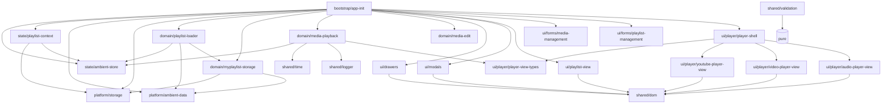
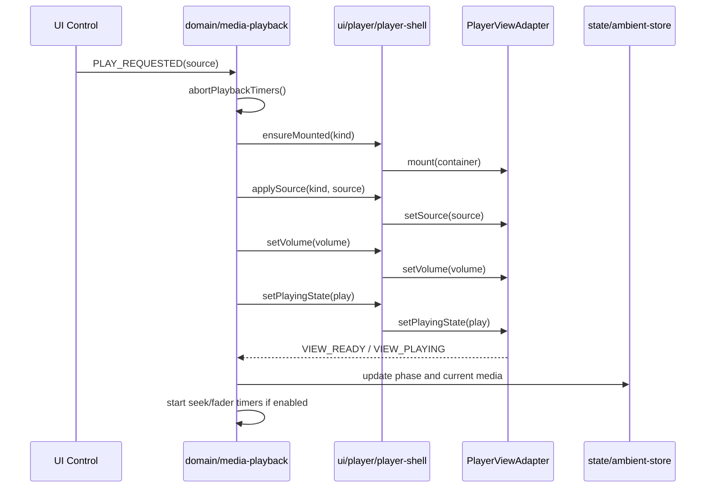
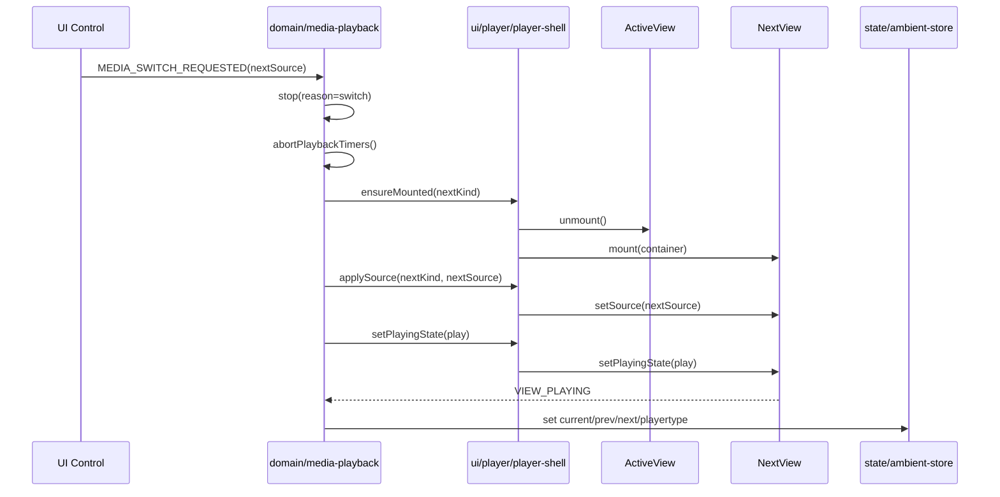
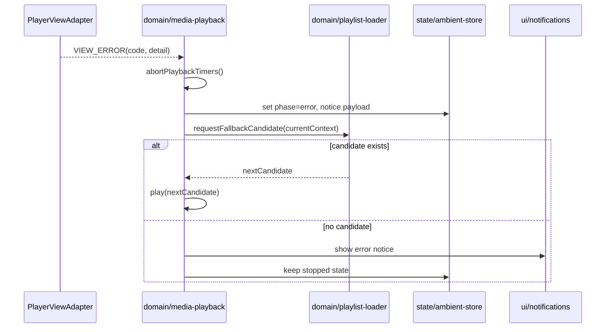

# v2.6.0 Modularization Detailed Design

Date: 2026-05-31  
Target release: v2.6.0  
Target area: src/scripts/ambient.ts modularization  
Related handoff: docs/operations/handoffs/20260531-v2-6-0-modularization-orchestrator-handoff.md

## 1. Purpose and Scope

This document defines an implementation-ready modularization design for v2.6.0.

Primary objective:
- Split the monolithic src/scripts/ambient.ts into cohesive modules while preserving existing behavior.

Mandatory policy applied in this design:
- Player UI is split into three view modules (YouTube, video, audio).
- domain/media-playback.ts remains the single unified playback domain logic.

In scope:
- Module boundaries, dependency rules, and forbidden dependencies.
- Interface contracts for domain, shell, and player views.
- Event and state flow contracts.
- Dependency and sequence diagrams.
- Incremental migration plan (Phase 0-5) with entry/exit and rollback points.
- Test strategy matrix and cross-player parity matrix.
- Risk register, mitigations, observability hooks.
- Definition of done per phase.

Out of scope:
- Direct implementation in src/ during design phase.
- New feature behavior beyond explicitly stated policy changes.

## 2. Assumptions and Compatibility Constraints

Assumptions:
1. Build pipeline stays Vite + current TS setup.
2. Existing AmbientData shape remains backward compatible.
3. Existing storage keys remain unchanged:
   - AmbientUserData
   - AmbientMyPlaylist
4. Existing cloud/local policy remains unchanged:
   - Cloud JSON playlists stay read-only.
   - MyPlaylist write path remains cloud-only localStorage persistence.

Compatibility constraints:
1. No behavioral drift in playlist loading, resume, seek/fader timing, modal flows, and notification behavior.
2. Existing DOM ids/classes and data attributes remain functional unless explicitly versioned.
3. Existing E2E scenarios must continue to pass with minimal selector churn.

## 3. Target Module Boundary Specification

## 3.1 Layer model

- bootstrap layer:
  - app initialization and wiring only
- state/platform layer:
  - state model, persistence adapter, ambient data adapter
- domain layer:
  - playlist load/persist/playback/edit business logic
- ui layer:
  - drawer/modal/forms/playlist rendering/player views
- shared layer:
  - pure utility modules

Dependency direction:
- bootstrap -> state/platform/domain/ui/shared
- ui -> state/platform/shared and domain contracts only
- domain -> state/platform/shared and abstract UI contracts only
- state/platform -> shared
- shared -> no internal project dependency

Forbidden direction (global):
- shared -> ui/domain/state/platform/bootstrap
- state/platform -> ui/domain/bootstrap
- domain -> concrete player view modules
- ui player view modules -> domain internals

## 3.2 Module map with responsibilities and forbidden dependencies

| Module | Responsibilities | Allowed direct dependencies | Forbidden dependencies |
|---|---|---|---|
| bootstrap/app-init.ts | startup order, one-time wiring, boot gate | all public module entrypoints | direct business logic implementation |
| state/ambient-store.ts | AMP_STATUS state model and watcher lifecycle | shared/logger.ts | ui modules, concrete storage APIs |
| state/playlist-context.ts | playlist/category/media resume context read/write | platform/storage.ts, shared/validation.ts | ui modules, player view modules |
| platform/ambient-data.ts | typed access to AmbientData and mode guards | shared/validation.ts | ui modules, domain internals |
| platform/storage.ts | key ownership, serialization, storage read/write abstraction | shared/logger.ts | ui modules, domain internals |
| domain/playlist-loader.ts | playlist load lifecycle, load sequence guards, fallback behavior | state/*, platform/*, shared/* | concrete ui implementations |
| domain/myplaylist-storage.ts | MyPlaylist seed/load/persist/sanitize orchestration | state/*, platform/*, shared/* | concrete ui implementations |
| domain/media-playback.ts | unified playback state transitions, seek/fader timer lifecycle, ended/error transitions | state/ambient-store.ts, shared/time.ts, shared/logger.ts, ui/player/player-view-types.ts | ui/player/youtube-player-view.ts, ui/player/video-player-view.ts, ui/player/audio-player-view.ts |
| domain/media-edit/* | edit draft state, seek validation, save pipeline | state/*, platform/*, domain/media-playback.ts contracts, shared/* | concrete player view modules |
| ui/drawers.ts | left/right drawer lifecycle and backdrop | state/ambient-store.ts, shared/dom.ts | domain internals |
| ui/modals.ts | option modal, description modal orchestration | state/ambient-store.ts, shared/dom.ts | domain internals |
| ui/playlist-view.ts | playlist list rendering, mode UI state, selection visuals | state/ambient-store.ts, shared/dom.ts | domain internals |
| ui/forms/media-management.ts | media add form binding and validation UI state | state/*, shared/*, domain contracts | direct storage writes |
| ui/forms/playlist-management.ts | playlist/category form binding and validation UI state | state/*, shared/*, domain contracts | direct storage writes |
| ui/player/player-shell.ts | active player view selection, mount/unmount orchestration, adapter lifecycle | ui/player/player-view-types.ts, concrete view modules | domain internals except declared contracts |
| ui/player/youtube-player-view.ts | YouTube iframe-specific UI mounting and event binding | ui/player/player-view-types.ts, shared/dom.ts | domain/* |
| ui/player/video-player-view.ts | HTML video-specific UI mounting and event binding | ui/player/player-view-types.ts, shared/dom.ts | domain/* |
| ui/player/audio-player-view.ts | HTML audio-specific UI mounting and event binding | ui/player/player-view-types.ts, shared/dom.ts | domain/* |
| ui/player/player-view-types.ts | shared adapter types and event payload types | none or shared types | runtime logic |
| shared/* | pure utility functions | none | all non-shared modules |

## 4. Interface Contracts

## 4.1 Playback domain contracts

File: domain/media-playback.ts

```ts
export type PlaybackKind = 'youtube' | 'video' | 'audio';

export interface PlaybackSource {
  kind: PlaybackKind;
  mediaId: number;
  videoId?: string;
  filePath?: string;
  startSec?: number;
  endSec?: number;
  fadeInSec?: number;
  fadeOutSec?: number;
  volume?: number;
  controls?: boolean;
  fullscreen?: boolean;
  ccLoadPolicy?: number;
  rel?: number;
}

export interface PlaybackStateSnapshot {
  activeMediaId: number | null;
  activeKind: PlaybackKind | null;
  phase: 'idle' | 'loading' | 'ready' | 'playing' | 'paused' | 'ended' | 'error';
  seekTimerActive: boolean;
  fadeInTimerActive: boolean;
  fadeOutTimerActive: boolean;
  lastError?: string;
}

export interface PlayerViewEvent {
  type:
    | 'VIEW_READY'
    | 'VIEW_PLAYING'
    | 'VIEW_PAUSED'
    | 'VIEW_ENDED'
    | 'VIEW_ERROR'
    | 'VIEW_TIME_UPDATE'
    | 'VIEW_DURATION'
    | 'VIEW_VOLUME_CHANGE';
  payload?: {
    seconds?: number;
    volume?: number;
    code?: string;
    detail?: string;
  };
}

export interface PlaybackDomainPort {
  play(source: PlaybackSource): Promise<void>;
  pause(): void;
  resume(): void;
  stop(reason?: string): void;
  seekTo(seconds: number): void;
  setVolume(volume: number): void;
  onViewEvent(event: PlayerViewEvent): void;
  getSnapshot(): PlaybackStateSnapshot;
  dispose(): void;
}
```

Contract rules:
1. PlaybackDomainPort is the single owner of seek/fader timer lifecycle.
2. play always aborts prior playback timers before starting new source.
3. domain/media-playback.ts must communicate with UI via PlayerViewAdapter only.
4. Domain emits state updates via store and/or domain events; it does not mutate view DOM directly.

## 4.2 Player view adapter contract

Files:
- ui/player/player-view-types.ts
- implemented by youtube-player-view.ts, video-player-view.ts, audio-player-view.ts

```ts
export type PlayerViewKind = 'youtube' | 'video' | 'audio';

export interface PlayerViewSource {
  videoId?: string;
  filePath?: string;
  controls?: boolean;
  fullscreen?: boolean;
  ccLoadPolicy?: number;
  rel?: number;
  startSec?: number;
  endSec?: number;
}

export interface PlayerViewUiEvents {
  onReady?: () => void;
  onPlaying?: () => void;
  onPaused?: () => void;
  onEnded?: () => void;
  onError?: (code: string, detail?: string) => void;
  onTimeUpdate?: (seconds: number) => void;
  onDuration?: (seconds: number) => void;
  onVolumeChange?: (volume: number) => void;
}

export interface PlayerViewAdapter {
  readonly kind: PlayerViewKind;
  mount(container: HTMLElement): Promise<void>;
  unmount(): void;
  setSource(source: PlayerViewSource): Promise<void>;
  setVolume(volume: number): void;
  setPlayingState(state: 'play' | 'pause' | 'stop'): void;
  bindUiEvents(events: PlayerViewUiEvents): void;
}
```

Adapter rules:
1. mount/unmount must be idempotent.
2. setSource must be safe to call repeatedly during media switch.
3. bindUiEvents must overwrite previous listeners to avoid duplicate callbacks.
4. View adapters must not read/write playlist or storage state.

## 4.3 Shell contracts between domain and views

File: ui/player/player-shell.ts

```ts
export interface PlayerShellPort {
  ensureMounted(kind: PlayerViewKind): Promise<void>;
  applySource(kind: PlayerViewKind, source: PlayerViewSource): Promise<void>;
  setVolume(volume: number): void;
  setPlayingState(state: 'play' | 'pause' | 'stop'): void;
  bindUiEvents(events: PlayerViewUiEvents): void;
  getActiveKind(): PlayerViewKind | null;
  teardown(): void;
}
```

Shell rules:
1. Exactly one active view at a time.
2. Switching kind performs ordered sequence: old.unmount -> new.mount -> new.setSource.
3. Shell translates common operations to active adapter.
4. Shell never owns playback decisions; it only applies requests from domain.

## 4.4 Event and state flow contracts

### Event taxonomy

Domain-intent events:
- PLAY_REQUESTED
- PAUSE_REQUESTED
- RESUME_REQUESTED
- STOP_REQUESTED
- MEDIA_SWITCH_REQUESTED
- VOLUME_CHANGED

View-origin events:
- VIEW_READY
- VIEW_PLAYING
- VIEW_PAUSED
- VIEW_ENDED
- VIEW_ERROR
- VIEW_TIME_UPDATE
- VIEW_DURATION

State-change events:
- PLAYBACK_PHASE_CHANGED
- ACTIVE_MEDIA_CHANGED
- PLAYLIST_CONTEXT_CHANGED
- NOTICE_RAISED

### State ownership

| State | Owner | Read by |
|---|---|---|
| AMP_STATUS.playertype/current/volume | state/ambient-store.ts | domain/ui |
| seek/fader timer handles | domain/media-playback.ts | domain/media-playback.ts only |
| active view adapter instance | ui/player/player-shell.ts | shell only |
| playlistContext persistence payload | state/playlist-context.ts | state/domain |
| MyPlaylist persisted payload | domain/myplaylist-storage.ts + platform/storage.ts | domain/state |

### Flow contract constraints

1. UI forms and controls dispatch intent events only.
2. Domain validates intent against current state and policy.
3. Domain calls shell methods; shell calls adapter methods.
4. View emits callback events via bindUiEvents.
5. Domain handles view callbacks, updates store, and triggers next intent when needed.

## 5. Dependency Diagram



## 6. Sequence Diagrams

## 6.1 Normal media play



## 6.2 Media switch



## 6.3 Error and fallback path



## 7. Migration Slicing Plan (Phase 0-5)

## 7.1 Phase overview with rollback points

| Phase | Goal | Rollback point |
|---|---|---|
| 0 | pre-work scaffolding, pure utility extraction | single PR revert of extracted shared modules and wrappers |
| 1 | state/platform extraction | keep ambient.ts compatibility wrappers and switch import flag off |
| 2 | domain extraction for playlist and playback | route playback calls back to legacy ambient.ts functions |
| 3 | UI orchestration and player split | shell toggle flag to legacy direct player path |
| 4 | media-edit isolation and preview contract alignment | keep legacy media-edit handlers behind feature flag |
| 5 | legacy flattening and dead code removal | release branch hard stop before removing fallback wrappers |

## 7.2 Entry and exit criteria per phase

### Phase 0
Entry:
1. Baseline branch prepared.
2. Existing E2E smoke baseline captured.

Exit:
1. shared/* pure utilities extracted with no behavior change.
2. Compatibility wrappers in ambient.ts keep original call sites valid.
3. Baseline observability hooks active.

### Phase 1
Entry:
1. Phase 0 complete.
2. Store/storage contract tests drafted.

Exit:
1. state/ambient-store.ts, state/playlist-context.ts, platform/ambient-data.ts, platform/storage.ts in active use.
2. AmbientUserData and playlistContext persistence unchanged.
3. Cloud/local mode guards unchanged.

### Phase 2
Entry:
1. Phase 1 complete.
2. Playlist load sequence and timer baseline tests available.

Exit:
1. domain/playlist-loader.ts, domain/myplaylist-storage.ts, domain/media-playback.ts wired through contracts.
2. seek/fader timer lifecycle parity validated.
3. MyPlaylist read/write policy preserved.

### Phase 3
Entry:
1. Phase 2 complete.
2. Player adapter contract tests ready.

Exit:
1. ui/player/player-shell.ts and 3 player view modules active.
2. domain/media-playback.ts has no concrete player view dependency.
3. Drawer/modal/forms/playlist view extraction complete with no behavior drift.

### Phase 4
Entry:
1. Phase 3 complete.
2. Media-edit regression suite stabilized.

Exit:
1. media-edit domain/ui split complete.
2. Preview player uses shared player adapter shape where applicable.
3. Validation and save pipeline parity confirmed.

### Phase 5
Entry:
1. Phase 4 complete.
2. Legacy wrapper deprecation list approved.

Exit:
1. ambient.ts reduced to composition root.
2. Dead wrappers/utilities removed.
3. Import cycles resolved and final type strictness gates pass.

## 8. Test Strategy Matrix

## 8.1 Test mapping by module and phase

| Module group | Phase(s) | Unit | Integration | E2E |
|---|---|---|---|---|
| shared/* | 0-5 | pure function tests | optional | none |
| state/* | 1-5 | watcher/state transition tests | playlist context persistence tests | resume smoke |
| platform/* | 1-5 | serialization/guard tests | storage compatibility tests | cloud/local boot smoke |
| domain/playlist-loader.ts | 2-5 | load-seq guard tests | playlist switch lifecycle tests | playlist switch regression |
| domain/myplaylist-storage.ts | 2-5 | sanitize/normalize tests | MyPlaylist roundtrip tests | cloud MyPlaylist scenarios |
| domain/media-playback.ts | 2-5 | timer/state machine tests | adapter-callback integration tests | play/switch/error fallback smoke |
| ui/player/* | 3-5 | adapter behavior tests | shell-view integration tests | cross-player parity scenarios |
| ui/forms/*, ui/modals.ts, ui/drawers.ts | 3-5 | validator/viewmodel tests | event binding tests | modal/drawer/form flows |
| domain/media-edit/* | 4-5 | validation/draft tests | save pipeline integration tests | media edit regression suite |

## 8.2 Phase gate verification checklist

| Phase | Required automated checks | Required manual checks |
|---|---|---|
| 0 | unit(shared), npm run typecheck, npm run build | smoke: app boot + playlist render |
| 1 | state/platform unit + integration, typecheck/build | smoke: resume playlist/category/media context |
| 2 | domain unit + integration, typecheck/build | smoke: seek/fader transitions and MyPlaylist persistence |
| 3 | player adapter unit + shell integration + e2e subset | smoke: YouTube/video/audio switch without UI regression |
| 4 | media-edit unit/integration + e2e targeted scenarios | smoke: edit open/save/cancel and preview seek sync |
| 5 | full regression pack + typecheck/build + e2e critical path | smoke: release candidate sanity on cloud/local |

## 8.3 Cross-player parity matrix

| Capability | YouTube | Video | Audio | Expected parity rule |
|---|---|---|---|---|
| mount/unmount lifecycle | yes | yes | yes | no leaked instance after switch |
| setSource and ready transition | yes | yes | yes | domain receives ready signal before play-state finalization |
| setVolume reflection | yes | yes | yes | volume in AMP_STATUS equals effective view volume |
| play/pause/stop state transitions | yes | yes | yes | identical state machine outcomes |
| ended event handling | yes | yes | yes | same next-media resolution policy |
| error callback and fallback trigger | yes | yes | yes | same error-to-fallback flow |
| seek/fader timer coordination | yes | yes | yes | timer start/stop policy identical |
| data-attribute observability updates | yes | yes | yes | standardized diagnostics fields updated |

## 9. Risk Register and Mitigation

| Risk | Impact | Mitigation | Observability hook |
|---|---|---|---|
| hidden closure coupling in ambient.ts | extraction breakage | extract pure modules first, then stateful units | debug logger channel modularization.phase |
| event order drift after relocation | playback or UI race | explicit sequence contract tests and shell idempotency checks | counters: playback.event.order_mismatch |
| timer leaks on play/switch/error | memory/perf degradation | single timer owner in domain/media-playback.ts and forced abort on transitions | metrics: seekTimerActive/fadeTimerActive snapshots |
| schema drift in AmbientUserData or AmbientMyPlaylist | resume/persist regression | fixture roundtrip compatibility tests | storage schema version marker and warn logs |
| player view divergence | inconsistent behavior by media type | shared adapter contract and parity matrix gates | parity report artifact per CI run |
| fallback path regression | playback dead-end on error | maintain explicit fallback contract and E2E error scenarios | data attribute: data-yt-phase/data-yt-error plus unified data-player-error |

## 10. Observability and Diagnostics Hooks

Required hooks for migration safety:
1. Structured debug logs
   - category: modularization
   - include phase, module, action, mediaId, playerKind
2. State snapshot probe
   - lightweight function to capture PlaybackStateSnapshot and critical AMP_STATUS fields
3. DOM diagnostic attributes
   - keep existing YouTube attributes
   - add generic player attributes:
     - data-player-kind
     - data-player-phase
     - data-player-error
4. Storage operation traces
   - read/write/fail logs for AmbientUserData and AmbientMyPlaylist
5. Test evidence artifacts
   - per-phase checklist with links to unit/integration/E2E result outputs

## 11. Definition of Done by Phase

### Phase 0 DoD
1. No functional behavior change proven by baseline comparison.
2. shared/* extraction merged with wrappers.
3. Build and typecheck clean.

### Phase 1 DoD
1. State/platform modules are active code paths.
2. Resume and persistence behavior unchanged.
3. Cloud/local mode policy unchanged.

### Phase 2 DoD
1. Domain modules own playlist load and playback/timer lifecycle.
2. Error/fallback and MyPlaylist behavior parity confirmed.
3. Regression suite for phase scope passes.

### Phase 3 DoD
1. Player shell + 3 view modules are active.
2. Domain has no concrete player-view dependency.
3. Cross-player parity matrix passes all mandatory rows.

### Phase 4 DoD
1. Media-edit logic isolated and contract-driven.
2. Preview player integration respects adapter model.
3. Media-edit regression scenarios pass.

### Phase 5 DoD
1. ambient.ts is composition root only.
2. Legacy compatibility wrappers removed.
3. Full quality gates pass for release candidate.

## 12. Implementation Handoff Notes

Recommended execution order:
1. Implement Phase 0-1 in small, reversible pull requests.
2. Treat Phase 2 and Phase 3 as separate stabilization milestones.
3. Start Phase 4 only after cross-player parity is green.
4. Enter Phase 5 only when fallback wrappers are no longer used by any call path.

Required non-negotiable policy checks in every phase:
1. Unified playback logic remains in domain/media-playback.ts.
2. UI split for player remains exactly three view modules.
3. Cloud JSON playlists remain read-only.
4. Existing behavior is preserved unless explicitly approved as a requirement change.
