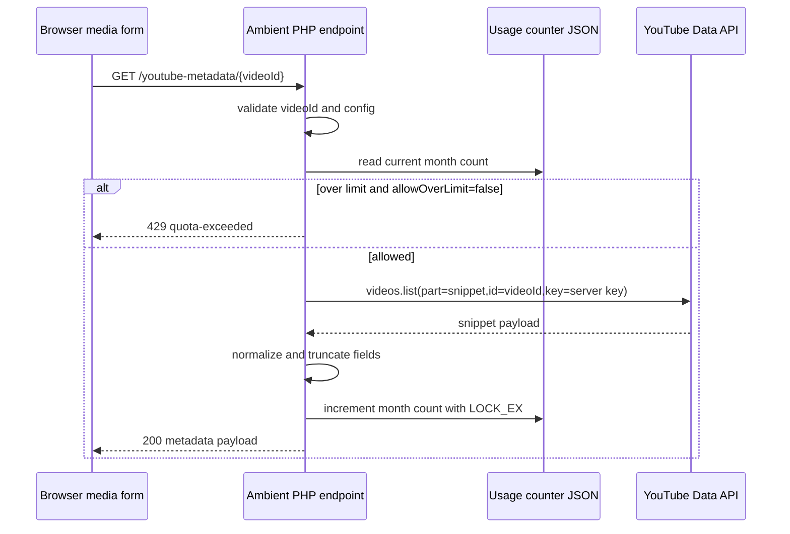

# v2.6.2 Detailed Design Draft

Date: 2026-07-30
Target release: v2.6.2
Feature: YouTube Data API metadata assistance for media registration
Source requirement: `.codex/memo.md`
Status: draft for review

## 1. Design Objective

Add a metadata-assist flow to YouTube media registration.

The implementation must:

- Keep YouTube Data API secrets on the server.
- Keep existing media registration and playlist persistence behavior intact.
- Avoid using API quota unnecessarily.
- Avoid overwriting user-entered metadata.
- Reuse the v2.6 modular architecture boundaries.

## 2. Layer Ownership

| Layer | Ownership |
|---|---|
| PHP config/bootstrap | env parsing and safe path resolution |
| PHP API | YouTube Data API call, quota counter, response normalization |
| platform/domain TS | metadata fetch client, response typing, in-memory cache |
| ui/forms TS | URL input observation, suggestion UI state, apply behavior |
| views PHP | static form markup for suggestion controls |
| i18n | labels, states, warnings, errors |
| tests | endpoint behavior, UI suggestion flow, no-regression checks |

Forbidden:

- Browser-side use of `YOUTUBE_DATA_API_KEY`.
- Direct storage writes from UI form modules.
- Metadata fetch as a hard requirement for adding media.
- Overwriting manually edited title/artist/description fields.

## 3. Data Contracts

### 3.1 AmbientData Capability

Add a public capability object to `AmbientData`.

```ts
export interface YouTubeMetadataCapability {
  enabled: boolean;
  monthlyLimit: number | null;
  allowOverLimit: boolean;
}

export interface AmbientDataGlobal {
  youtubeMetadata?: YouTubeMetadataCapability;
}
```

Rules:

1. `enabled` is true only when `YOUTUBE_DATA_API_KEY` is configured.
2. `monthlyLimit` is numeric when limit enforcement is configured; `null` means unlimited.
3. `allowOverLimit` mirrors `YOUTUBE_METADATA_ALLOW_OVER_LIMIT`.
4. No key, counter path, upstream URL, or private filesystem path is serialized.

### 3.2 Internal API Request

Endpoint:

```http
GET /youtube-metadata/{videoId}
```

Video id validation:

```regex
^[A-Za-z0-9_-]{6,32}$
```

The upper bound is intentionally wider than the common 11-character YouTube id to avoid false negatives if YouTube changes id length, while still rejecting path injection and arbitrary strings.

### 3.3 Internal API Success Response

```ts
export interface YouTubeMetadataUsage {
  month: string;
  count: number;
  limit: number | null;
  limited: boolean;
}

export interface YouTubeMetadataPayload {
  videoId: string;
  title: string;
  artist: string;
  desc: string;
  source: 'youtube-data-api';
  usage: YouTubeMetadataUsage;
}

export interface YouTubeMetadataApiSuccess {
  state: 'ok';
  code: 200;
  data: YouTubeMetadataPayload;
}
```

### 3.4 Internal API Error Response

```ts
export interface YouTubeMetadataApiError {
  state: 'error';
  code: 400 | 403 | 404 | 429 | 502 | 500;
  data: {
    message: string;
    reason:
      | 'invalid-video-id'
      | 'not-configured'
      | 'not-found'
      | 'quota-exceeded'
      | 'upstream-error'
      | 'counter-error';
    usage?: YouTubeMetadataUsage;
  };
}
```

Recommended status mapping:

- `400`: invalid video id.
- `403`: API key not configured.
- `404`: YouTube API returned no item.
- `429`: monthly limit exceeded and over-limit mode is disabled.
- `502`: upstream request failed or returned unexpected shape.
- `500`: counter path/read/write error.

## 4. Environment Configuration Design

### 4.1 Variables

```dotenv
YOUTUBE_DATA_API_KEY=
YOUTUBE_METADATA_MONTHLY_LIMIT=10000
YOUTUBE_METADATA_ALLOW_OVER_LIMIT=false
YOUTUBE_METADATA_COUNTER_PATH=logs/youtube-metadata-usage.json
YOUTUBE_METADATA_TIMEOUT_MS=5000
```

### 4.2 Parsing Rules

- `YOUTUBE_DATA_API_KEY`: trim. Empty means disabled.
- `YOUTUBE_METADATA_MONTHLY_LIMIT`: integer. Values less than `1` mean unlimited only if explicitly documented; initial implementation should clamp invalid values to default `10000`.
- `YOUTUBE_METADATA_ALLOW_OVER_LIMIT`: parse with existing `amp_env_bool()`.
- `YOUTUBE_METADATA_COUNTER_PATH`: if relative, resolve from `APP_ROOT`; if absolute, use as-is after normalization.
- `YOUTUBE_METADATA_TIMEOUT_MS`: integer, clamp to `1000..15000`.

### 4.3 Counter Path Safety

Implementation should add a file-path resolver distinct from `amp_resolve_dir()` because the setting points to a JSON file, not a directory.

Suggested helper:

```php
function amp_resolve_path( string $path, string $root_path ): string
```

Rules:

1. Normalize backslashes to forward slashes.
2. Resolve relative path against `APP_ROOT`.
3. Ensure parent directory exists or create it.
4. Do not serve or expose this path to the client.
5. Document that production should use a path above the document root.

## 5. Server Flow

### 5.1 Sequence



### 5.2 Upstream Request

YouTube endpoint:

```text
https://www.googleapis.com/youtube/v3/videos?part=snippet&id={videoId}&key={apiKey}
```

Use PHP standard functions available in the project environment:

- Preferred: `curl` if available.
- Fallback: `file_get_contents()` with stream context and timeout.

No new Composer dependency is recommended for this feature.

### 5.3 Normalization

Map:

- `items[0].snippet.title` -> `title`
- `items[0].snippet.channelTitle` -> `artist`
- `items[0].snippet.description` -> `desc`

Sanitization:

- Reuse or align with `sanitize_text()`.
- Title: max 100, no newlines.
- Artist: max 100, no newlines.
- Desc: max 1000, allow newlines, collapse excessive whitespace/newlines.

Important follow-up:

- Existing PHP `sanitize_and_normalize_media_item()` currently truncates desc to 500.
- Existing TS `MEDIA_DESC_MAX_LENGTH` is 500.
- Existing `#media-desc` markup has `maxlength="500"`.
- Implementation must update all three together if 1000 is approved.

## 6. Usage Counter Design

### 6.1 Storage Shape

```json
{
  "version": 1,
  "months": {
    "2026-07": {
      "youtubeMetadataRequests": 123,
      "updatedAt": "2026-07-30T23:59:00+09:00"
    }
  }
}
```

### 6.2 Counting Policy

Recommended policy:

- Check limit before upstream request.
- Increment only after a successful YouTube API response that contains a valid item.

Tradeoff:

- This counts successful metadata retrievals, not all attempted upstream calls.
- It may undercount failed upstream attempts, but better matches user-visible benefit and avoids burning the monthly limit on transient errors.

If strict quota accounting is preferred, increment before upstream call. That should be explicit because failed network calls would still consume the local counter.

### 6.3 Concurrency

Use `file_put_contents($path, $json, LOCK_EX)` for writes.

Recommended safer update sequence:

1. Read existing file.
2. Decode JSON.
3. Update current month.
4. Write to temp file with lock.
5. Rename temp file to target.

Minimum acceptable sequence:

1. Read existing file.
2. Decode JSON.
3. Update current month.
4. `file_put_contents(..., LOCK_EX)`.

Given this is a low-write feature, minimum sequence is acceptable for v2.6.2 if implementation remains small.

## 7. Frontend Flow

### 7.1 URL Input State Machine

States:

- `disabled`: capability off or current playlist cannot be mutated.
- `idle`: URL is empty or invalid.
- `ready`: valid video id extracted.
- `loading`: metadata request in progress.
- `suggested`: metadata fetched and suggestions available.
- `applied`: suggestions applied.
- `failed`: non-limit error.
- `limited`: monthly limit reached.

### 7.2 Debounce and Stale Response Guard

When `#youtube-url` input validates:

1. Extract `videoId` and update `#youtube-videoid` as today.
2. Debounce metadata fetch by about `500ms`.
3. Store request token `{ videoId, sequence }`.
4. On response, apply only if current `#youtube-videoid` still matches response `videoId` and sequence is latest.

### 7.3 Session Cache

Keep an in-memory map:

```ts
const metadataCache = new Map<string, YouTubeMetadataPayload>();
```

Cache scope:

- Current page session only.
- Do not use localStorage/sessionStorage for API metadata cache in v2.6.2.

Reasoning:

- Avoids repeated calls while editing.
- Avoids long-lived stale metadata and storage policy complexity.

### 7.4 Field Overwrite Rules

Track per field:

- `lastSuggestedValue`
- `lastAppliedValue`
- `dirtyByUser`

Recommended simple implementation:

- On metadata response:
  - Title direct-fill only if field is empty or equals the previous applied suggestion.
  - Artist and desc are shown as suggestions.
- On user input:
  - If value differs from `lastAppliedValue`, mark dirty.
- On Apply:
  - Set field value.
  - Dispatch `input` and `change`.
  - Store `lastAppliedValue`.
  - Clear dirty flag for that field.

### 7.5 UI Placement

Add a compact block below YouTube URL helper text and above hidden `#youtube-videoid`.

Recommended markup ids:

- `#youtube-metadata-assist`
- `#youtube-metadata-status`
- `#youtube-metadata-title-suggestion`
- `#youtube-metadata-artist-suggestion`
- `#youtube-metadata-desc-suggestion`
- `#btn-apply-youtube-metadata-title`
- `#btn-apply-youtube-metadata-artist`
- `#btn-apply-youtube-metadata-desc`
- `#btn-apply-youtube-metadata-all`
- `#btn-dismiss-youtube-metadata`

UI notes:

- Use existing Tailwind/Flowbite compact form styling.
- Do not create large cards inside the modal.
- Keep text small enough for mobile.
- Description suggestion should be clamped visually with expand/collapse if it can be long.

## 8. Module Changes

### 8.1 PHP

Expected edits during implementation:

- `config/bootstrap.php`
  - optional `amp_resolve_path()`
- `src/Ambient.php`
  - add route case for metadata endpoint
  - add public capability to localized `AmbientData`
- `src/api.php`
  - add metadata handler
  - add YouTube API request helper
  - add counter read/write helpers
  - update description max length from 500 to 1000 if approved
- `.env.example`
  - add YouTube metadata env variables
- `README.md`, `README-ja.md`
  - document setup and production counter path recommendation

### 8.2 TypeScript

Expected edits during implementation:

- `src/scripts/types/ambient.ts`
  - add `youtubeMetadata` capability type
- `src/scripts/domain/youtube-metadata.ts`
  - metadata response types
  - fetch/cache/stale guard helpers, or pure normalization helpers
- `src/scripts/ui/forms/media-management.ts`
  - bind metadata assist to URL input
  - apply suggestions
  - preserve existing validation behavior
- `src/scripts/ambient.ts`
  - wire new dependencies into media management binding
  - update `MEDIA_DESC_MAX_LENGTH` to 1000 if approved
- `src/scripts/shared/media-sanitize.ts`
  - no functional change expected unless description newline behavior changes

### 8.3 View and i18n

Expected edits during implementation:

- `views/collapse.php`
  - add suggestion UI markup
  - update `#media-desc maxlength` to 1000 if approved
- `assets/langs/*.json`
  - add new labels/messages

### 8.4 Tests

Expected edits during implementation:

- `tests/e2e/scenarios/sc-007-management.spec.ts`
  - no-key/disabled UI behavior
  - mocked endpoint suggestion apply behavior
- `tests/e2e/scenarios/sc-010-cloud-myplaylist-regression.spec.ts`
  - cloud MyPlaylist registration still works with metadata assist enabled/disabled
- Potential new scenario:
  - `tests/e2e/scenarios/sc-022-youtube-metadata-assist.spec.ts`

## 9. API Mocking Strategy for E2E

Use Playwright route interception for internal Ambient endpoint:

```ts
await page.route('**/youtube-metadata/dQw4w9WgXcQ', async (route) => {
  await route.fulfill({
    status: 200,
    contentType: 'application/json',
    body: JSON.stringify({
      state: 'ok',
      code: 200,
      data: {
        videoId: 'dQw4w9WgXcQ',
        title: 'Mock YouTube Title',
        artist: 'Mock Channel',
        desc: 'Mock description',
        source: 'youtube-data-api',
        usage: {
          month: '2026-07',
          count: 1,
          limit: 10000,
          limited: false
        }
      }
    })
  });
});
```

For capability gating, inject or assert `window.AmbientData.youtubeMetadata`.

If the app renders capability from PHP only, run dedicated PHP server smoke checks with environment variables set.

## 10. Security and Privacy

Security controls:

1. API key is read from server env only.
2. Internal endpoint accepts only video id, not arbitrary URL.
3. Video id is regex validated.
4. Counter path is never returned to client.
5. YouTube descriptions are sanitized and length-limited before response.
6. Client inserts suggestions with textContent/value only, not HTML.

Privacy notes:

- The server sends the video id to YouTube Data API.
- No Ambient playlist contents need to be sent upstream.
- The internal counter stores only aggregate month counts, not video ids.

## 11. Failure Behavior

Manual registration remains available in all failure states.

Expected user-visible behavior:

- Missing API key: no suggestion controls, or a muted "not configured" state if debug is enabled.
- Quota exceeded: warning state near URL field; title remains manually editable.
- Upstream error: non-blocking failure state; existing form validation unaffected.
- Invalid URL: existing invalid URL validation remains authoritative.

## 12. Acceptance Criteria

1. With no `YOUTUBE_DATA_API_KEY`, the app behaves like v2.6.1 for media registration.
2. With a configured key, entering a valid YouTube URL fetches metadata through the internal API.
3. API key does not appear in HTML, `window.AmbientData`, network calls from browser to Google, or logs.
4. Title is auto-filled only when safe.
5. Artist and description can be applied from suggestions.
6. User-entered metadata is never overwritten by stale or later responses.
7. Monthly counter is created, read, updated, and limit-checked.
8. Limit exceeded disables metadata fetch by default but does not disable manual media registration.
9. Description max length is consistently enforced at the approved value.
10. Existing MyPlaylist and local JSON media-add flows still pass.

## 13. Draft Handoff for Implementation Agent

Context:

- v2.6.2 is a metadata assistance feature for YouTube media registration.
- Existing media management form already validates YouTube URL and extracts video id.
- Existing server API is PHP route/trait based.

Task:

- Implement the server-side YouTube metadata endpoint, monthly usage counter, frontend metadata suggestion UI, and related i18n/docs/tests.

Constraints:

- Do not expose API key to the browser.
- Do not make metadata fetch mandatory for media registration.
- Do not overwrite manual field edits.
- Keep existing v2.6 module boundaries.

Acceptance criteria:

- See Section 12.

Deliverables:

- Source changes in PHP/TS/views/i18n/docs/tests.
- Validation evidence for typecheck, build, i18n, targeted E2E, and endpoint behavior.

## 14. Open Risks

1. YouTube Data API quota semantics are unit-based, while the proposed counter is request-count based. This is acceptable because `videos.list` with `part=snippet` should be a stable single-purpose call, but release docs should avoid claiming it is an exact Google quota mirror.
2. PHP environments without `curl` may need stream fallback validation.
3. Changing description field from one-line input to textarea would improve UX for 1000 characters, but it increases UI scope. Initial implementation can keep input if scope must stay smaller.
4. Existing import/sanitize code truncates desc to 500 and must be updated in the same implementation if the new max is approved.
