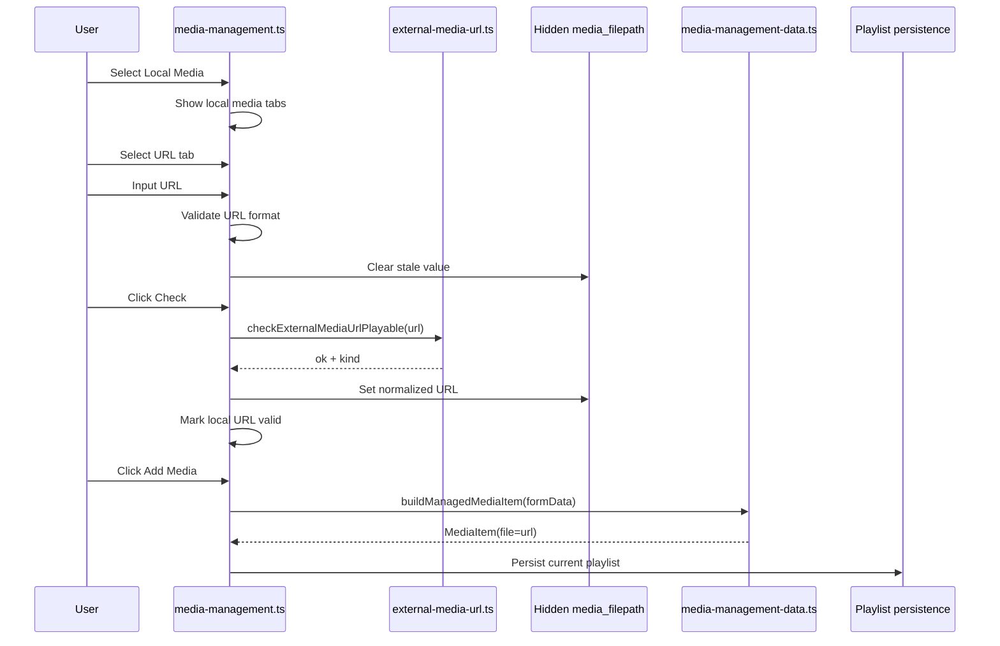
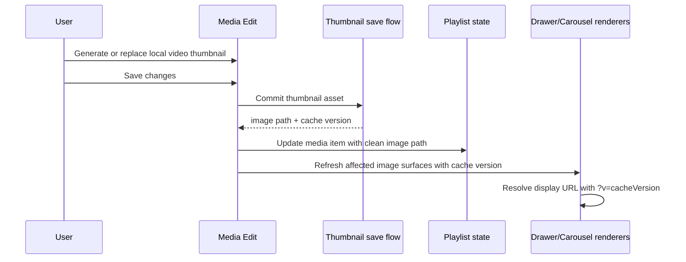

# v2.6.4 Design

Date: 2026-08-02
Target release: v2.6.4
Design scope: Local Media URL registration, cloud/local media-management policy, and local thumbnail cache invalidation after Media Edit.

## 1. Requirements

### Functional requirements

1. Fix the cloud-mode regression around Local Media selection.
2. Add URL-based Local Media registration.
3. In cloud mode:
   - Local Media can be selected.
   - URL registration is available.
   - Host-computer file upload registration is disabled.
4. In local mode:
   - Existing file upload registration remains available.
   - URL registration is also available.
   - Upload tab is the initial active tab.
5. Both cloud/local should use the same tabbed Local Media UI where possible.
6. URL input and connection check button are displayed as an input group.
7. Connection check button is disabled until the URL format is valid.
8. After connection check confirms browser-playable media, Add Media becomes available.
9. Media Edit must not allow changing an external media URL.
10. When a local video thumbnail is regenerated or replaced through Media Edit, playlist drawer and carousel images must refresh immediately even if the saved image path is unchanged.

### Non-functional requirements

1. Preserve current TypeScript module boundaries from the v2.6.0 modularization.
2. Avoid playlist schema churn unless required.
3. Keep existing localStorage and JSON playlist compatibility.
4. Avoid server-side network probing for arbitrary URLs in v2.6.4 unless a blocker appears.
5. Keep UI behavior consistent across cloud and local.
6. Keep cache-busting query parameters out of persisted playlist data.

## 2. Design Decisions

### 2.1 Storage contract

Use existing `MediaItem.file` for both:

- Local relative media paths, for example `sample.mp4`
- External media URLs, for example `https://example.com/media/sample.mp4`

Rationale:

- `resolveHtmlMediaSourcePath()` already returns `http(s)` URLs directly.
- `player-setup.ts` already resolves HTML player kind from `MediaItem.file` extension.
- Existing playlist persistence paths already serialize `file`.

No schema change is planned for v2.6.4.

### 2.2 URL support policy

Supported URL schemes:

- `https://`
- `http://`

Rejected schemes/forms:

- relative paths
- `file:`
- `javascript:`
- `data:`
- `blob:`
- protocol-relative `//example.com/media.mp4`

Supported media type inference:

- Audio extensions already supported by `resolveHtmlPlayerKind()`
- Video extensions already supported by `resolveHtmlPlayerKind()`

Extensionless URLs are out of scope for v2.6.4 because the current player selection pipeline is extension-based.

### 2.3 Playability check

The browser is the source of truth for external URL playability.

Proposed helper:

```ts
export interface ExternalMediaUrlCheckResult {
  ok: boolean;
  url: string;
  kind: 'audio' | 'video' | null;
  reason?: 'invalid-url' | 'unsupported-extension' | 'unsupported-mime' | 'load-timeout' | 'load-error';
  message: string;
}
```

Suggested location:

- `src/scripts/platform/external-media-url.ts`

Responsibilities:

1. Parse and normalize URL.
2. Extract extension from pathname.
3. Resolve expected player kind via the same rules as `player-setup.ts`.
4. Check `audio.canPlayType(mime)` or `video.canPlayType(mime)`.
5. Load metadata in an off-DOM media element.
6. Resolve success on `loadedmetadata` or `canplay`.
7. Resolve failure on `error` or timeout.
8. Clean up media element event handlers and `src`.

Timeout:

- Suggested default: 8000 ms.

Reasoning:

- `HEAD` requests are unreliable for media URLs due to CORS and server behavior.
- Browser media loading tests the same capability used for playback.

### 2.4 Thumbnail cache invalidation

Local video thumbnail generation may overwrite the same image asset path. In that case, the browser can keep showing the stale cached image in the playlist drawer or carousel even after the media item has been saved.

Design policy:

- `MediaItem.image` remains the canonical persisted asset path.
- Cache-busting query parameters are added only when resolving a display URL for UI rendering.
- The cache-busting version should be scoped to the updated media image path.
- A save-time timestamp is acceptable for v2.6.4 if the thumbnail save flow does not already expose a content hash or modified time.
- External image URLs and YouTube thumbnails should not receive Ambient-generated cache-busting query parameters by default.

Proposed helper shape:

```ts
export function resolveMediaImageDisplayUrl(imagePath: string | null | undefined, cacheVersion?: string | number): string;
export function shouldApplyAmbientImageCacheBust(imagePath: string): boolean;
```

Suggested location:

- Prefer an existing shared media/image helper if one already exists.
- Otherwise add a small helper under `src/scripts/ui/media-image-url.ts` or another established UI utility location found during implementation inspection.

The helper should preserve existing placeholder fallback behavior and append the cache version using `?v=...` or `&v=...` depending on whether the path already contains a query string.

## 3. UI Design

### 3.1 Media type selector

Existing top-level radio group remains:

- YouTube Media
- Local Media

Changed policy:

- Cloud mode no longer disables the Local Media radio solely because the environment is cloud.
- Mutability still depends on current playlist editability.

### 3.2 Local Media tab UI

When Local Media is selected, render a tabbed panel:

- Upload
- URL

Initial active tab:

| Environment | Initial active tab | Upload tab |
|---|---|---|
| local | Upload | enabled when playlist is mutable |
| cloud | URL | disabled |

Cloud Upload tab behavior:

- Disabled tab button.
- Upload input, picker, and dropzone disabled or hidden inside inactive panel.
- Tooltip/title or note explains host-computer files are unavailable in cloud mode.

### 3.3 URL input group

Markup concept:

```html
<div id="local-media-url-panel">
  <label for="local-media-url">Media URL</label>
  <div class="flex">
    <input id="local-media-url" name="local_media_url" type="url" />
    <button id="btn-check-local-media-url" type="button" disabled>Check</button>
  </div>
  <span id="note-error-local-media-url"></span>
  <span id="note-success-local-media-url"></span>
  <input id="local-media-filepath" name="media_filepath" type="hidden" />
</div>
```

The existing hidden field name `media_filepath` should remain the committed source for the selected local media input method.

### 3.4 Validation states

URL input:

- Empty: neutral.
- Invalid format: error.
- Valid format, unchecked: neutral or pending; check button enabled.
- Checking: button disabled, status visible.
- Playable: success; hidden `media_filepath` receives normalized URL.
- Failed: error; hidden `media_filepath` cleared.

Submit button:

- YouTube mode: existing YouTube validation.
- Local/upload: existing file validation.
- Local/url: URL check success required.

## 4. Module Design

### 4.1 `views/collapse.php`

Planned changes:

1. Remove unconditional cloud disable from `#media-type-local`.
2. Wrap local media controls with tab buttons and tab panels.
3. Keep existing upload controls but place them in Upload tab panel.
4. Add URL tab panel with URL input group.
5. Add data attributes for environment defaults:
   - `data-default-local-input-mode="upload|url"`
   - `data-cloud-upload-disabled="true|false"`

### 4.2 `src/scripts/ui/forms/media-management.ts`

Planned changes:

1. Bind local media tabs.
2. Track active local input mode.
3. Clear stale local input state when switching between upload and URL.
4. Bind `local_media_url` input:
   - validate format
   - enable/disable check button
   - clear hidden `media_filepath` when changed
5. Bind `check_local_media_url` button:
   - call external URL checker
   - update validation notes
   - write normalized URL to `media_filepath` on success
6. Extend submit validation logic so local URL mode requires checked URL.

### 4.3 `src/scripts/platform/external-media-url.ts`

New helper module for URL registration only.

Potential public functions:

```ts
export function isValidExternalMediaUrlFormat(value: string): boolean;
export function normalizeExternalMediaUrl(value: string): string | null;
export function checkExternalMediaUrlPlayable(url: string, timeoutMs?: number): Promise<ExternalMediaUrlCheckResult>;
```

This module may reuse:

- `resolveHtmlMediaMimeType()`
- `resolveHtmlPlayerKind()` or a shared equivalent extension resolver

If importing from UI modules would violate layering, extract extension/player-kind helpers into `shared/media-source.ts` and update imports.

### 4.4 `src/scripts/domain/media-management-data.ts`

No major change expected.

Confirm:

- `media_filepath` URL is accepted as `mediaItem.file`.
- No local-relative path validation is performed at domain-build level.

### 4.5 `src/scripts/ui/forms/cloud-edit-restrictions.ts`

Refactor restriction rules into two dimensions:

1. Playlist mutability:
   - disables all add/edit controls when false.
2. Environment capability:
   - disables only host file upload controls in cloud mode.

Avoid disabling `#media-type-local` in cloud mode when current playlist is mutable.

### 4.6 Media Edit modules

Relevant files to inspect during implementation:

- `src/scripts/ui/media-edit/form-view.ts`
- `src/scripts/ui/media-edit/modal-view.ts`
- `src/scripts/domain/media-edit/*`

Design:

- Treat `MediaItem.file` source as immutable in edit UI.
- Existing source badge/display can show the URL.
- Do not add a writable URL field for external URLs.
- Save pipeline must preserve original `file`.

### 4.7 Thumbnail rendering and refresh modules

Relevant files to inspect during implementation:

- Media Edit thumbnail generation/save modules.
- Playlist drawer rendering modules.
- Carousel/current media rendering modules.
- Any shared media thumbnail/placeholder helper.

Design:

1. When Media Edit saves a regenerated local video thumbnail, capture a cache version for the updated media item image.
2. Store that version in runtime UI state or pass it through the post-save refresh path.
3. Re-render only the affected image surfaces where possible:
   - playlist drawer item thumbnail
   - carousel/current media thumbnail
   - media edit preview after commit if it remains open or is reopened from cached state
4. Preserve persisted playlist data:
   - `image: "assets/images/example.webp"` stays unchanged.
   - UI `src` may become `"assets/images/example.webp?v=..."`.
5. Keep non-local image behavior stable:
   - Do not modify YouTube thumbnail URLs.
   - Do not modify externally hosted image URLs unless the implementation already treats them as Ambient-managed local assets.

## 5. State Flow

### 5.1 URL registration sequence



### 5.2 Mode switching rules

When switching YouTube to Local:

- Hide YouTube URL panel.
- Show local media tab container.
- Keep selected category.
- Clear YouTube-only hidden video ID.

When switching Local to YouTube:

- Hide local media tab container.
- Show YouTube URL panel.
- Clear local hidden `media_filepath`.
- Keep selected category.

When switching Local Upload to Local URL:

- Clear upload file selection and validation.
- Clear local metadata suggestions from file reads.
- Do not clear common metadata fields unless the existing reset behavior requires it.

When switching Local URL to Local Upload:

- Clear URL check status.
- Clear hidden `media_filepath`.
- Do not leave Add Media enabled from previous URL success.

### 5.3 Thumbnail refresh sequence



## 6. Test Design

### Unit/focused tests

1. URL format validation accepts only `http(s)`.
2. URL normalization trims whitespace.
3. Unsupported extension rejects before load.
4. URL change clears prior success state.
5. Domain build maps `media_filepath=https://.../x.mp4` to `MediaItem.file`.
6. Image display URL helper appends cache version only for Ambient-managed local image paths.
7. Image display URL helper does not mutate persisted `MediaItem.image` values.

### E2E scenarios

1. Cloud mutable MyPlaylist:
   - Open Media Management.
   - Select Local Media.
   - Assert URL tab active.
   - Assert Upload tab disabled.
   - Input valid-looking media URL.
   - Check button becomes enabled.
2. Local mode:
   - Select Local Media.
   - Assert Upload tab active.
   - Switch to URL tab.
   - Assert URL input and check button behavior.
3. Regression:
   - YouTube registration still validates.
   - Local upload still validates in local mode.
   - Category selection survives media type changes.
4. Media Edit:
   - Open URL-registered media.
   - Assert source URL is not editable.
5. Thumbnail refresh regression:
   - Edit a local video media item.
   - Regenerate or replace its thumbnail using the same saved asset path.
   - Save changes.
   - Assert playlist drawer thumbnail `src` changes by cache version or otherwise reloads.
   - Assert carousel/current media image updates without page reload.
   - Assert persisted playlist data keeps the clean image path.

### Validation commands

```powershell
npm run typecheck
npm run build
npm run check:i18n
npm run test:e2e:cloud:chrome
npm run test:e2e:local:chrome
```

## 7. Open Questions

1. Should extensionless media URLs be supported in a later version through a server-side proxy/API content-type check?
2. Should URL connection checks allow URLs that can play but cannot expose metadata due to CORS/browser policy?
3. Should HTTP URLs be allowed in production cloud mode, or should cloud mode require HTTPS only?

Recommended default for v2.6.4:

- Reject extensionless URLs.
- Require browser metadata/canplay success.
- Allow `http://` for local deployments, but consider warning or HTTPS-only policy for public cloud later.
