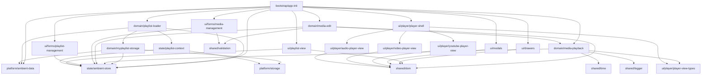

# 20260531 v2.6.0 Modularization Design Draft Handoff

Date: 2026-05-31  
Target branch (planning): `feature/v2.5.3`  
Target release for implementation: `v2.6.0` (minor)  
Owner role: `orchestrator`

## Context

- `src/scripts/ambient.ts` has grown into a monolithic entry script (8k+ lines, many tightly-coupled responsibilities).
- Current `v2.5.3` is positioned as patch-up work with low regression tolerance.
- Broad structural refactor (module split) is deferred to `v2.6.0` to align with release risk policy and roadmap.

## Objective

Produce an implementation-ready modularization draft for `v2.6.0`, including:

- dependency graph of target submodules,
- migration order (incremental slices),
- test perspectives and evidence plan.

## Task

Design a safe extraction plan that keeps behavior unchanged while splitting responsibilities currently concentrated in `src/scripts/ambient.ts`.

## Constraints

- Preserve runtime behavior unless explicitly changed by requirement.
- Keep `v2.5.3` scope to refactor pre-work only (no broad architecture rewrite in patch).
- Avoid introducing heavy new dependencies for modularization itself.
- Maintain compatibility with current build pipeline (Vite + existing TS setup).
- Keep cloud/local mode behavior and MyPlaylist read-only rules intact.

## Acceptance Criteria

- A target module map is defined with clear boundaries and dependency direction.
- Migration is split into executable phases with rollback points.
- Each phase has verification checkpoints (manual + automated where feasible).
- Known high-risk areas and mitigation are documented.

## Deliverables

- This handoff draft under `docs/operations/handoffs/`.
- Follow-up design task packages for specialist agents (`design-agent`, `implementation-agent`, `test-debug-agent`) based on this draft.

## Proposed Target Module Map

### Core Modules

1. `bootstrap/app-init.ts`
- App startup, boot gate, one-time event wiring coordinator.

2. `state/ambient-store.ts`
- `AMP_STATUS` state model, watcher registration, state mutation hooks.

3. `state/playlist-context.ts`
- Persist/restore playlist/category/media context.

4. `platform/ambient-data.ts`
- Typed access layer for `window.AmbientData` and mode guards.

5. `platform/storage.ts`
- localStorage/sessionStorage abstraction and key ownership.

### Domain Modules

6. `domain/playlist-loader.ts`
- Playlist fetch/load lifecycle, load sequence guards, reset policy.

7. `domain/myplaylist-storage.ts`
- Cloud MyPlaylist seed/load/persist/sanitization orchestration.

8. `domain/media-playback.ts`
- YouTube/HTML playback state transitions, seek/fader timer lifecycle.

9. `domain/media-edit/`
- Modal state, draft state, seek validation, preview sync, save pipeline.

10. `domain/import/playlist-import.ts`
- Import schema checks, sanitize/normalize, size tier decisions.

### UI Modules

11. `ui/drawers.ts`
- Left/right drawer lifecycle and backdrop coordination.

12. `ui/modals.ts`
- Option modal and playlist-desc modal orchestration.

13. `ui/playlist-view.ts`
- Playlist rendering, mode switch visuals, selection/focus updates.

14. `ui/forms/media-management.ts`
- Media management form events and validation hooks.

15. `ui/forms/playlist-management.ts`
- Category/playlist management form events and controls.

16. `ui/notifications.ts`
- Toast/notice view updates.

### Player UI Modules (Formalized)

17. `ui/player/player-shell.ts`
- Selects and mounts one of three player UI views (YouTube / video / audio).
- Owns mount/unmount timing and active-view switching.

18. `ui/player/youtube-player-view.ts`
- YouTube IFrame-specific view initialization and UI wiring only.

19. `ui/player/video-player-view.ts`
- HTML `<video>` view initialization and presentation-specific handling.

20. `ui/player/audio-player-view.ts`
- HTML `<audio>` view initialization and presentation-specific handling.

21. `ui/player/player-view-types.ts`
- Shared adapter contract for player views.
- Expected unified methods: `mount`, `unmount`, `setSource`, `setVolume`, `setPlayingState`, `bindUiEvents`.

### Shared Utilities

22. `shared/dom.ts`, `shared/string.ts`, `shared/time.ts`, `shared/validation.ts`, `shared/logger.ts`
- Current tail utility section extraction with unit-testable pure functions first.

## Player Split Policy (Adopted)

- Domain logic remains centralized in `domain/media-playback.ts`.
- UI is split into three dedicated player views: YouTube / HTML video / HTML audio.
- `domain/media-playback.ts` must not directly depend on concrete view implementations.
- `ui/player/player-shell.ts` integrates concrete views through `ui/player/player-view-types.ts` adapter contracts.
- Media-edit preview player should converge to the same adapter model in a later phase to reduce duplicate playback UI logic.

## Dependency Graph (Draft)

## Incremental Migration Order (v2.6.0)

### Phase 0: v2.5.3 Pre-work (no behavior change)

1. Add module boundaries as comment markers + extraction backlog IDs in `src/scripts/ambient.ts`.
2. Move pure utilities from tail section into `shared/*` (small PRs, no side-effect code).
3. Add thin adapter wrappers so call sites remain stable.
4. Add baseline regression checklist and capture current behavior snapshots.

### Phase 1: State/Platform extraction

1. Extract `platform/ambient-data.ts` and `platform/storage.ts`.
2. Extract `state/ambient-store.ts` and `state/playlist-context.ts`.
3. Keep old function names as pass-through until all call sites migrate.

### Phase 2: Domain extraction (read/write sensitive)

1. Extract playlist load flow (`domain/playlist-loader.ts`).
2. Extract MyPlaylist storage flow (`domain/myplaylist-storage.ts`).
3. Extract playback timer control (`domain/media-playback.ts`).

### Phase 3: UI orchestration extraction

1. Extract drawer/modal/playlist-view UI handlers.
2. Extract form modules for media/playlist management.
3. Extract `ui/player/player-shell.ts` and three concrete player view modules.
4. Move event binding bootstraps into `bootstrap/app-init.ts`.

### Phase 4: Media-edit isolation

1. Move media-edit modal logic into `domain/media-edit/*` and `ui/media-edit/*` split.
2. Introduce explicit interfaces for draft state and validator result objects.
3. Align media-edit preview player to `ui/player/player-view-types.ts` where applicable.
4. Add focused integration tests for media-edit save pipeline.

### Phase 5: Legacy flattening

1. Reduce `ambient.ts` to composition root only.
2. Delete dead wrappers and duplicate utility functions.
3. Final pass for type strictness and import cycles.

## Test Perspectives And Evidence Plan

### A. Safety Net Before Extraction

- Baseline scenarios:
  - playlist switch + category switch + resume context,
  - cloud MyPlaylist create/load/save,
  - media edit validation/save/cancel,
  - seek/fader timers around media boundary transitions.
- Snapshot artifacts:
  - DOM behavior checkpoints,
  - localStorage key/value checkpoints (`AmbientUserData`, `AmbientMyPlaylist`).

### B. Per-Phase Verification

1. Unit tests (new pure modules)
- `shared/*`, validation logic, time conversions, sanitize helpers.

2. Integration tests (state + domain)
- playlist loading lifecycle, load-seq guard behavior, persistence side effects.

3. E2E smoke/regression
- existing critical scenarios + targeted additions for extracted flows.

4. Player UI parity checks
- Verify identical expected behavior across YouTube / video / audio for:
  - play/pause/ended transition handling,
  - seek/fader timing behavior,
  - volume and error-state reflection in UI.

### C. Non-Functional Checks

- Build/typecheck gate: `npm run typecheck`, `npm run build`.
- Performance sanity: initial boot latency and playlist render regressions.
- Compatibility sanity: cloud/local mode parity and read-only restrictions.

## Risk Register

1. Hidden coupling via closure-scoped variables in current `init` block.
- Mitigation: extract pure modules first, then stateful modules.

2. Event ordering regressions after handler relocation.
- Mitigation: phase-by-phase binding parity checks and DOM signal assertions.

3. Persistence schema drift (`AmbientUserData`, `AmbientMyPlaylist`).
- Mitigation: schema compatibility tests and fixture-based roundtrip tests.

4. Media-edit complexity causing late-cycle instability.
- Mitigation: isolate as dedicated late phase with stronger test focus.

5. Behavioral drift between the three player views.
- Mitigation: adapter contract tests + cross-player parity scenario matrix.

## Recommended Next Specialist Handovers

1. `design-agent`
- Convert this draft into detailed design spec with interface contracts and file map.

2. `implementation-agent`
- Execute only Phase 0 in `v2.5.3` (pure utility extraction + adapters).

3. `test-debug-agent`
- Create baseline verification matrix and evidence templates before Phase 1.
